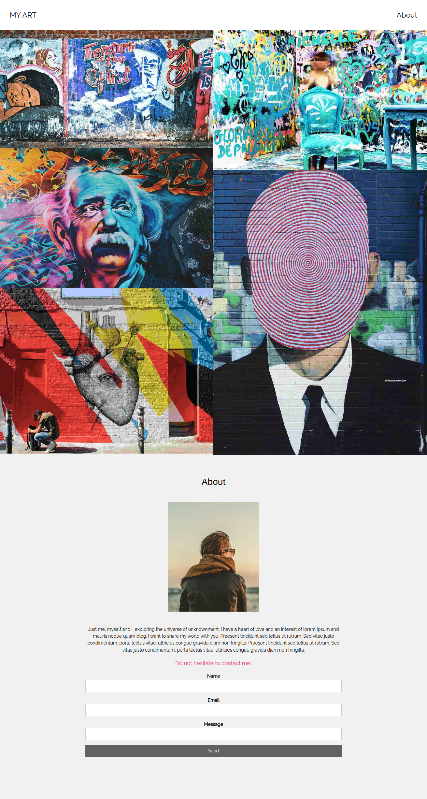
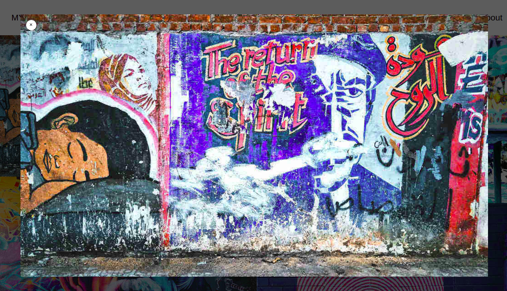
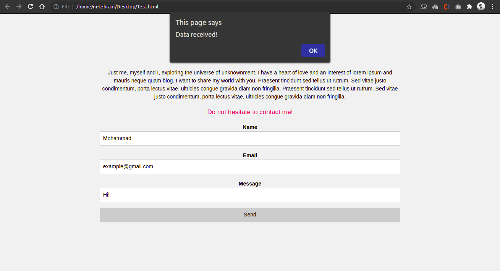

# Maktab 52 - Quiz 2#
### Coverage: html, css, bootstrap, JS, jQuery and Ajax
### Time: 1:30
**Note:** Implement your Styles & Scripts into the HTML file (Local), for better Submission . 

### Task 1#: HTML & CSS (45 min, 40 pt)  
Create a html/css web page like this:   
(use bootstrap grid system to make it responsive)  
- Desktop viewport:

  
- Mobile viewport:  
  
 

### Task 2#: JS & jQuery (25 min, 30 pt)  
Use JavaScript & jQuery technologies to create an image preview section like the example below:  
(Show: on Image click, Dismiss on Preview section click or Dismiss button on the top)

*__(Alternatively, you can use Bootstrap Modals to do the same, but it has a lower score)__*

### Task 3#: Ajax & jQuery Ajax (20 min, 30 pt)
Use Ajax & jQuery Ajax to __POST__ the contact form to the following api:  
API url: http://ma-web.ir/maktab52/quiz2.php   
Response format: `{ 'data': ..., 'msg': ... }`  
Then, _alert()_ the response **msg** into the web page.  
__Note:__ Make sure the CORS plugin is active and Cross-origin requests are allowed from the web page.  

# * Submission:
Sent your submission as an HTML file into your *__Telegram__* cardboard.
